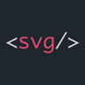
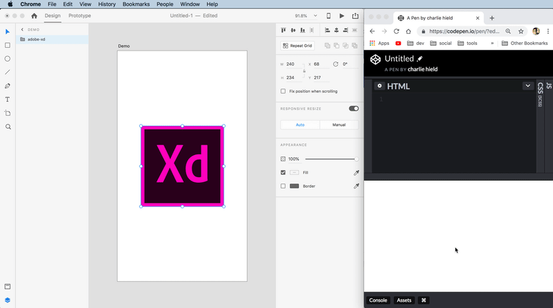

# Copy SVG Code

> Adobe XD Plugin to generate SVG code from selection.

## Demo

## Todo

Not sure if all of these are possible, but things I'd like to add.

- [ ] Add right click dialog
- [ ] Add shortcut
- [ ] Allow for multiple selections / Auto group selections
- [ ] Optimize with `svgo`
- [ ] Allow user to change default options
- [ ] Get cooler icon (any designers out there?!)
